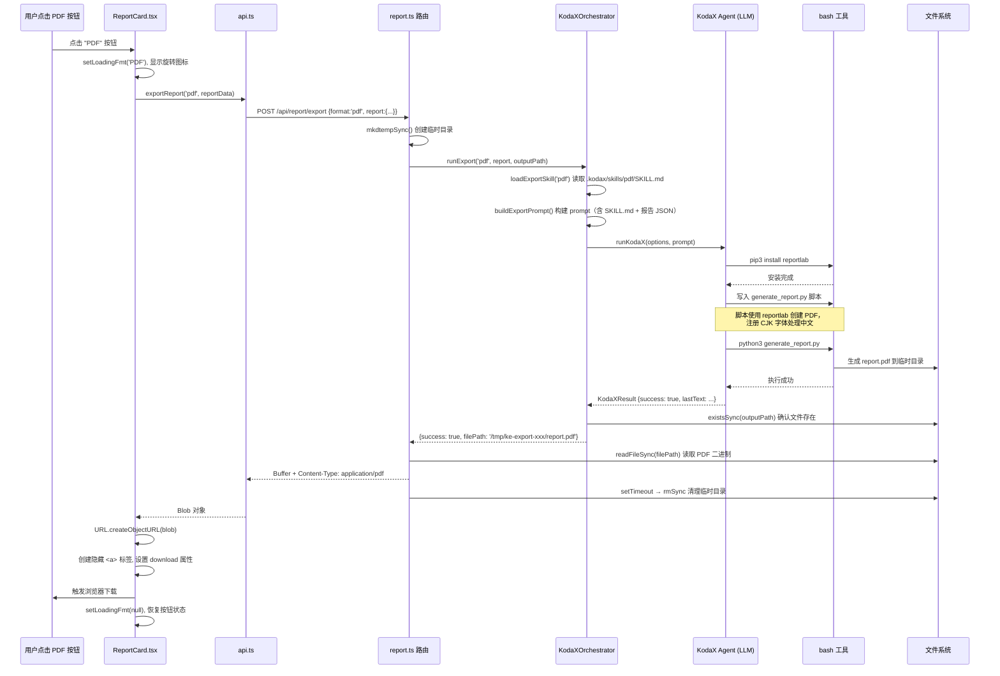

# PDF 导出处理流程

## 全链路时序图

## 各层职责说明

### 1. 前端 ReportCard.tsx — 用户交互层

按钮点击后，通过 `FORMAT_MAP` 把 "PDF" 映射为 `'pdf'`，设置 loading 状态，调用 API，拿到 Blob 后用 `createObjectURL` + 动态 `<a>` 标签触发浏览器原生下载。

**关键代码路径：** `frontend/src/components/CenterPanel/ReportCard.tsx`

### 2. 前端 api.ts — HTTP 请求层

用 axios 发送 POST 请求，关键是 `responseType: 'blob'`，让 axios 把响应解析为二进制 Blob 而不是 JSON。超时设为 180 秒，因为 KodaX 编排需要时间。

**关键代码路径：** `frontend/src/services/api.ts` → `exportReport()`

### 3. 后端 report.ts 路由 — 请求处理层

在系统临时目录 (`/tmp/ke-export-xxx/`) 创建隔离的工作空间，调用 KodaX 编排器，拿到生成的文件后读取二进制内容，设置正确的 `Content-Type` 和 `Content-Disposition` 头返回。5 秒后异步清理临时目录。

**关键代码路径：** `backend/src/routes/report.ts`

### 4. KodaXOrchestrator.runExport — 编排层

这是核心。它做三件事：

- 读取 `.kodax/skills/pdf/SKILL.md`，获取 PDF 生成的完整知识（reportlab 用法、字体处理等）
- 把 SKILL.md 内容 + 报告数据 JSON + 具体生成指令组装成一个 prompt
- 调用 `runKodaX()` 让 LLM Agent 自主执行

**关键代码路径：** `backend/src/services/KodaXOrchestrator.ts` → `runExport()`

### 5. KodaX Agent — 实际执行层

LLM 拿到 prompt 后，依据 SKILL.md 中 reportlab 的使用指南：

- 用 bash 工具安装 `reportlab`（如果还没装）
- 编写一个 Python 脚本，使用 `reportlab.platypus` 创建 PDF
- 注册 CJK 字体（如 macOS 上的 STHeiti/PingFang）以支持中文
- 执行脚本，在指定路径生成 PDF 文件

## 架构设计理念

这套流程符合"智能体系统挂载 skill"的架构理念 —— 整个 PDF 生成不是硬编码的，而是 **KodaX Agent 阅读 SKILL.md 后自主编排执行的**。如果将来换成其他 PDF 库，只需要更新 SKILL.md，无需改代码。

同样的机制也适用于 Word（docx）和 Excel（xlsx）导出，只是加载的 SKILL.md 和 LLM 生成的脚本不同：

| 格式 | Skill 路径 | 生成库 | 脚本语言 |
|------|-----------|--------|---------|
| PDF  | `.kodax/skills/pdf/SKILL.md` | reportlab | Python |
| Word | `.kodax/skills/docx/SKILL.md` | docx-js | Node.js |
| Excel | `.kodax/skills/xlsx/SKILL.md` | openpyxl | Python |
